# Wizard of IV -- Complete Workflow & Decision Tree

> **Source files:**
> - Config: `public/wizard-of-iv/wizard-config.json`
> - Logic: `public/wizard-of-iv/wizard.js`
> - Styles: `public/wizard-of-iv/wizard.css`

---

## How to read this document

- **[Q]** = a question screen the user sees
- **-->** = "leads to"
- **[RESULT]** = a treatment recommendation screen (terminal node)
- **[BUNDLE]** = a recommendation that combines a primary treatment + optional add-on
- Indentation shows depth in the tree
- Every possible click path is documented below

---

## Entry Point

User clicks a "Find My Treatment" button (any element with `data-treatment-wizard` attribute). Modal opens.

---

## The Decision Tree

### [Q] START: "What brings you in today?"

Six top-level paths:

| # | Option | Goes to |
|---|--------|---------|
| 1 | "I need relief right now" | --> [Q] Acute |
| 2 | "I want to improve my wellness" | --> [Q] Wellness |
| 3 | "I want to lose weight" | --> [Q] Weight Loss |
| 4 | "I need blood work done" | --> [Q] Labs |
| 5 | "I just want a quick injection" | --> [Q] Quick Shot |
| 6 | "I'm not sure -- help me decide" | --> [Q] Symptoms (multi-select) |

---

## PATH 1: "I need relief right now"

### [Q] ACUTE: "What's going on?"

| Option | Result |
|--------|--------|
| "Hangover / drank too much" | --> **[RESULT] Hangover IV** ($250) |
| "Migraine or severe headache" | --> **[RESULT] Migraine IV** ($250) |
| "Getting sick / cold or flu" | --> **[RESULT] Immunity IV** ($220) |
| "Dehydrated or exhausted" | --> [Q] Dehydrated or Tired |
| "Altitude sickness" | --> **[RESULT] Altitude Sickness IV** ($250) |
| "Jet lag / just traveled" | --> **[BUNDLE] Myers' Cocktail** ($220) -- with jet-lag-specific whyMatch text |
| "Recovering from illness or burnout" | --> **[RESULT] Revival IV** ($395) |

#### [Q] DEHYDRATED OR TIRED: "What best describes how you feel?"

| Option | Result |
|--------|--------|
| "Dehydrated -- not drinking enough, heat, vomiting" | --> **[RESULT] Hydration IV** ($120) |
| "Exhausted / run-down / depleted" | --> [Q] Myers' Upgrade |

*(Myers' Upgrade is a shared question -- see below)*

---

## PATH 2: "I want to improve my wellness"

### [Q] WELLNESS: "What's your wellness goal?"

| Option | Result |
|--------|--------|
| "More energy / less brain fog" | --> [Q] Energy |
| "Better skin, hair, and nails" | --> **[BUNDLE] Beauty Glow Package** (Myers' $220 + optional Biotin shot +$35) |
| "Athletic performance / recovery" | --> [Q] Athletic Goal |
| "Anti-aging / longevity" | --> [Q] Anti-Aging |
| "General tune-up" | --> [Q] Myers' Upgrade |
| "Immune system support" | --> **[RESULT] Immunity IV** ($220) |
| "Recurring migraines / prevention" | --> **[RESULT] Migraine IV** ($250) |
| "Addiction / withdrawal support" | --> [Q] NAD+ Dose |
| "Prenatal support" | --> **[RESULT] Pregnancy / Prenatal IV** ($220) |

#### [Q] ENERGY: "How long have you been feeling this way?"

| Option | Result |
|--------|--------|
| "Just this week" | --> [Q] Myers' Upgrade |
| "A few weeks or months" | --> [Q] NAD+ Dose |
| "A long time / months or years" | --> [Q] NAD+ Dose |

#### [Q] ATHLETIC GOAL: "What's your focus?"

| Option | Result |
|--------|--------|
| "Post-workout / competition recovery" | --> **[RESULT] Performance IV** ($295) |
| "Cellular energy and deep recovery" | --> [Q] NAD+ Dose |

#### [Q] ANTI-AGING: "What's your approach to anti-aging?"

| Option | Result |
|--------|--------|
| "Longevity IV -- full vitamin stack + NAD+" | --> **[RESULT] Longevity IV** ($250) |
| "NAD+ IV -- focused cellular repair" | --> [Q] NAD+ Dose |

---

## PATH 3: "I want to lose weight"

### [Q] WEIGHT LOSS: "Where are you in your weight loss journey?"

| Option | Result |
|--------|--------|
| "Just starting -- I want medical support" | --> [Q] GLP-1 Choice |
| "Already on a program, need a boost" | --> [Q] Weight Loss Boost |
| "I want to explore my options" | --> [Q] GLP-1 Compare |

#### [Q] GLP-1 CHOICE: "Which GLP-1 program fits your goals?"

| Option | Result |
|--------|--------|
| "Semaglutide (Ozempic/Wegovy) -- from $199/mo" | --> **[RESULT] Semaglutide** ($199/mo) |
| "Tirzepatide (Mounjaro/Zepbound) -- from $399/mo" | --> **[RESULT] Tirzepatide** ($399/mo) |
| "Help me choose" | --> [Q] GLP-1 Compare |

#### [Q] GLP-1 COMPARE: "Semaglutide vs. Tirzepatide"

| Option | Result |
|--------|--------|
| "Semaglutide -- the proven choice" | --> **[RESULT] Semaglutide** ($199/mo) |
| "Tirzepatide -- maximum results" | --> **[RESULT] Tirzepatide** ($399/mo) |
| "I'd like to talk to someone first" | --> **[BUNDLE] Weight Loss Consultation** (shows Semaglutide info + phone number) |

#### [Q] WEIGHT LOSS BOOST: "What kind of support do you need?"

| Option | Result |
|--------|--------|
| "Lipo-Mino injections" | --> **[RESULT] Lipo-Mino Injections** ($35/shot) |
| "Full IV for energy during weight loss" | --> [Q] Myers' Upgrade |

---

## PATH 4: "I need blood work done"

### [Q] LABS: "What kind of blood work do you need?"

| Option | Result |
|--------|--------|
| "Basic health check" | --> **[RESULT] General Wellness Panel** ($175) |
| "Deeper health assessment" | --> **[RESULT] In-Depth Wellness Panel** ($199) |
| "Check my vitamin levels" | --> **[RESULT] Vitamin Level Panel** ($225) |
| "Full comprehensive panel" | --> **[RESULT] Complete Wellness Panel** ($449) |

*(All 4 are direct/terminal -- no further branching)*

---

## PATH 5: "I just want a quick injection"

### [Q] QUICK SHOT: "Which injection do you need?"

| Option | Result |
|--------|--------|
| "B12 -- Energy and metabolism" | --> **[RESULT] B12 Injection** ($35) |
| "Glutathione -- Detox and glow" | --> **[RESULT] Glutathione Injection** ($35) |
| "Tri-Immune -- Triple immune defense" | --> **[RESULT] Tri-Immune Injection** ($35) |
| "Vitamin D -- Bone, mood, immune" | --> **[RESULT] Vitamin D Injection** ($35) |
| "Biotin -- Hair, skin, nails" | --> **[RESULT] Biotin Injection** ($35) |
| "Lipo-Mino -- Fat metabolism" | --> **[RESULT] Lipo-Mino Injections** ($35) |

*(All 6 are direct/terminal -- no further branching)*

---

## PATH 6: "I'm not sure -- help me decide" (Multi-Select Symptoms)

### [Q] SYMPTOMS: "What resonates with you?" (select all that apply)

This is the only **multi-select** question. User picks one or more symptoms, then the system **scores** all treatments and returns a ranked list.

#### Available symptoms and what they score:

| Symptom | Treatments scored (weight) |
|---------|---------------------------|
| Tired all the time | Myers' (3), NAD+ 250 (3), NAD+ 100 (2), Revival (2), B12 Shot (2), Vitamin Lab (1) |
| Frequent headaches | Migraine (5), Myers' (2), Hydration (2) |
| Getting sick often | Immunity (5), Tri-Immune (3), Myers' (2), Vitamin D (2) |
| Skin looks dull or aging | Glutathione (4), Biotin (3), Longevity (3), Myers' (2) |
| Sore muscles / slow recovery | Performance (5), Myers' (2), NAD+ 500 (2), NAD+ 250 (1) |
| Struggling with weight | Semaglutide (5), Tirzepatide (4), Lipo-Mino (3) |
| Brain fog / can't focus | NAD+ 250 (5), NAD+ 500 (4), NAD+ 100 (3), Longevity (3), Myers' (1) |
| Dehydrated / dry all the time | Hydration (5), Myers' (3), Altitude (2) |
| Stressed and burnt out | Revival (3), Myers' (3), NAD+ 250 (3) |
| Not sure what I'm missing | Vitamin Lab (4), In-Depth Lab (3), General Lab (2) |

#### How scoring works:

1. For each selected symptom, add that symptom's score to each treatment it maps to
2. Sort all treatments by total accumulated score (highest first)
3. **Deduplicate by category** -- keep only the top scorer per category (iv, nad, weightLoss, lab, injection)
4. Return: up to **3 IV/NAD results** + all weight loss programs + all labs/injections that scored
5. Display each result with its "addressed by" explanation text

#### Scoring example:

If user selects **"Tired all the time"** + **"Brain fog / can't focus"**:

| Treatment | Tired score | Brain fog score | **Total** | Category |
|-----------|------------|-----------------|-----------|----------|
| NAD+ 250 | 3 | 5 | **8** | nad |
| Myers' | 3 | 1 | **4** | iv |
| NAD+ 500 | 0 | 4 | **4** | nad |
| NAD+ 100 | 2 | 3 | **5** | nad |
| Longevity | 0 | 3 | **3** | iv |
| Revival | 2 | 0 | **2** | iv |
| B12 Shot | 2 | 0 | **2** | injection |
| Vitamin Lab | 1 | 0 | **1** | lab |

After dedup (best per category): NAD+ 250 (8, nad), Myers' (4, iv), B12 Shot (2, injection), Vitamin Lab (1, lab)
Final display: **NAD+ 250, Myers', B12 Shot, Vitamin Lab**

---

## Shared Questions (Reachable from Multiple Paths)

### [Q] MYERS' UPGRADE: "Which Myers' level fits you?"

**Reachable from:** Acute > Exhausted, Wellness > General tune-up, Wellness > Energy > Just this week, Weight Loss > Boost > IV for energy

| Option | Result |
|--------|--------|
| "Standard Myers' -- $220" | --> **[RESULT] Myers' Cocktail** ($220) |
| "Myers' Gold -- $275" | --> **[RESULT] Myers' Gold** ($275) |
| "Myers' Platinum -- $375" | --> **[RESULT] Myers' Platinum** ($375) |
| "I'd rather try NAD+ therapy" | --> [Q] NAD+ Dose |

### [Q] NAD+ DOSE: "Which NAD+ dose is right for you?"

**Reachable from:** Wellness > Energy > weeks/months, Wellness > Energy > long time, Wellness > Addiction support, Wellness > Athletic > Cellular energy, Wellness > Anti-aging > NAD+, Myers' Upgrade > NAD+ option

| Option | Result |
|--------|--------|
| "100mg -- Entry level" | --> **[RESULT] NAD+ IV 100mg** ($100) |
| "250mg -- Most popular" | --> **[BUNDLE] NAD+ 250mg + Vitamin Level Panel** ($250 + optional $225 lab) |
| "500mg -- Deep restoration" | --> **[RESULT] NAD+ IV 500mg** ($400) |

**Special rule in code:** Any recommendation of `nad250` is automatically upgraded to the `nadPlusLabs` bundle (see `showResult()` line 707-709 in wizard.js).

---

## Bundles (Combined Offerings)

Bundles display a primary treatment with an optional interactive add-on toggle.

| Bundle ID | Display Name | Primary Treatment | Add-On | Add-On Interactive? |
|-----------|-------------|-------------------|--------|-------------------|
| `beautyBundle` | Beauty Glow Package | Myers' ($220) | Biotin Shot (+$35) | Yes (toggle) |
| `nadPlusLabs` | NAD+ IV + Vitamin Level Panel | NAD+ 250mg ($250) | Vitamin Level Panel (+$225) | Yes (toggle) |
| `weightLossConsult` | Weight Loss Consultation | Semaglutide ($199/mo) | None (shows phone #) | No (consultation) |
| `jetLagMyers` | Myers' Cocktail | Myers' ($220) | None | No |

When `addOnInteractive: true`, the result screen shows a toggle the user can click to add/remove the add-on before booking.

---

## Add-On Suggestions (Symptom Path Only)

When results come from the multi-select symptom scoring path, each primary treatment can show suggested add-on injections:

| Primary Treatment | Suggested Add-Ons |
|-------------------|-------------------|
| Immunity IV | Tri-Immune Shot, Vitamin D Shot |
| Myers' Cocktail | B12 Shot, Glutathione Shot |
| Performance IV | Lipo-Mino Shot, B12 Shot |
| Longevity IV | Glutathione Shot |
| Hydration IV | B12 Shot |
| Migraine IV | Vitamin D Shot |
| Hangover IV | B12 Shot |

---

## Complete Treatment Catalog

### IV Treatments

| ID | Name | Price | Duration |
|----|------|-------|----------|
| `hydration` | Hydration IV | $120 | 30-45 min |
| `myers` | Myers' Cocktail | $220 | 30-45 min |
| `immunity` | Immunity IV | $220 | 30-45 min |
| `pregnancy` | Pregnancy / Prenatal IV | $220 | 30-45 min |
| `altitude` | Altitude Sickness IV | $250 | 30-45 min |
| `hangover` | Hangover IV | $250 | 30-45 min |
| `migraine` | Migraine IV | $250 | 30-45 min |
| `longevity` | Longevity IV | $250 | 30-45 min |
| `myersGold` | Myers' Gold | $275 | 30-45 min |
| `performance` | Performance IV | $295 | 30-45 min |
| `myersPlatinum` | Myers' Platinum | $375 | 30-45 min |
| `revival` | Revival IV | $395 | 30-45 min |

### NAD+ Therapy

| ID | Name | Price | Duration |
|----|------|-------|----------|
| `nad100` | NAD+ IV (100mg) | $100 | 60-90 min |
| `nad250` | NAD+ IV (250mg) | $250 | 60-90 min |
| `nad500` | NAD+ IV (500mg) | $400 | 60-90 min |

### Weight Loss Programs

| ID | Name | Price | Duration |
|----|------|-------|----------|
| `semaglutide` | Semaglutide (GLP-1) | from $199/mo | Ongoing |
| `tirzepatide` | Tirzepatide (GLP-1+GIP) | from $399/mo | Ongoing |

### Quick Injections ($35 each, 5 min)

| ID | Name |
|----|------|
| `b12Shot` | B12 Injection |
| `biotinShot` | Biotin Injection |
| `glutathioneShot` | Glutathione Injection |
| `triImmuneShot` | Tri-Immune Injection |
| `vitaminDShot` | Vitamin D Injection |
| `lipoShots` | Lipo-Mino Injections |

### Lab Panels

| ID | Name | Price |
|----|------|-------|
| `labGeneral` | General Wellness Panel | $175 |
| `labInDepth` | In-Depth Wellness Panel | $199 |
| `labVitamin` | Vitamin Level Panel | $225 |
| `labComplete` | Complete Wellness Panel | $449 |

---

## Visual Flowchart (Mermaid)

Paste this into any Mermaid renderer (GitHub renders it natively, or use mermaid.live) to see the full interactive flowchart.

```mermaid
flowchart TD
    START["<b>START</b><br/>What brings you in today?"]

    START -->|"I need relief right now"| ACUTE
    START -->|"I want to improve my wellness"| WELLNESS
    START -->|"I want to lose weight"| WEIGHTLOSS
    START -->|"I need blood work done"| LABS
    START -->|"I just want a quick injection"| QUICKSHOT
    START -->|"I'm not sure -- help me decide"| SYMPTOMS

    %% ── PATH 1: ACUTE ──────────────────────────────────────
    ACUTE["<b>ACUTE</b><br/>What's going on?"]
    ACUTE -->|"Hangover"| R_HANGOVER(["Hangover IV<br/>$250"])
    ACUTE -->|"Migraine"| R_MIGRAINE(["Migraine IV<br/>$250"])
    ACUTE -->|"Sick / cold or flu"| R_IMMUNITY(["Immunity IV<br/>$220"])
    ACUTE -->|"Dehydrated or exhausted"| DEHYDRATED
    ACUTE -->|"Altitude sickness"| R_ALTITUDE(["Altitude IV<br/>$250"])
    ACUTE -->|"Jet lag"| R_JETLAG(["Myers' Cocktail<br/>$220<br/><i>bundle: jetLagMyers</i>"])
    ACUTE -->|"Burnout / recovering"| R_REVIVAL(["Revival IV<br/>$395"])

    DEHYDRATED["<b>DEHYDRATED OR TIRED</b><br/>What best describes you?"]
    DEHYDRATED -->|"Dehydrated"| R_HYDRATION(["Hydration IV<br/>$120"])
    DEHYDRATED -->|"Exhausted / depleted"| MYERSUPGRADE

    %% ── PATH 2: WELLNESS ───────────────────────────────────
    WELLNESS["<b>WELLNESS</b><br/>What's your wellness goal?"]
    WELLNESS -->|"Energy / brain fog"| ENERGY
    WELLNESS -->|"Skin, hair, nails"| R_BEAUTY(["Beauty Glow Package<br/>Myers' $220<br/>+ optional Biotin +$35<br/><i>bundle: beautyBundle</i>"])
    WELLNESS -->|"Athletic / recovery"| ATHLETIC
    WELLNESS -->|"Anti-aging"| ANTIAGING
    WELLNESS -->|"General tune-up"| MYERSUPGRADE
    WELLNESS -->|"Immune support"| R_IMMUNITY
    WELLNESS -->|"Recurring migraines"| R_MIGRAINE
    WELLNESS -->|"Addiction / withdrawal"| NADDOSE
    WELLNESS -->|"Prenatal"| R_PREGNANCY(["Pregnancy IV<br/>$220"])

    ENERGY["<b>ENERGY</b><br/>How long feeling this way?"]
    ENERGY -->|"Just this week"| MYERSUPGRADE
    ENERGY -->|"Weeks or months"| NADDOSE
    ENERGY -->|"Months or years"| NADDOSE

    ATHLETIC["<b>ATHLETIC</b><br/>What's your focus?"]
    ATHLETIC -->|"Post-workout recovery"| R_PERFORMANCE(["Performance IV<br/>$295"])
    ATHLETIC -->|"Cellular energy"| NADDOSE

    ANTIAGING["<b>ANTI-AGING</b><br/>Your approach?"]
    ANTIAGING -->|"Longevity IV"| R_LONGEVITY(["Longevity IV<br/>$250"])
    ANTIAGING -->|"NAD+ IV"| NADDOSE

    %% ── SHARED: MYERS UPGRADE ──────────────────────────────
    MYERSUPGRADE["<b>MYERS' UPGRADE</b><br/>Which level fits you?<br/><i>(shared node -- 4 paths lead here)</i>"]
    MYERSUPGRADE -->|"Standard $220"| R_MYERS(["Myers' Cocktail<br/>$220"])
    MYERSUPGRADE -->|"Gold $275"| R_MYERSGOLD(["Myers' Gold<br/>$275"])
    MYERSUPGRADE -->|"Platinum $375"| R_MYERSPLAT(["Myers' Platinum<br/>$375"])
    MYERSUPGRADE -->|"Try NAD+ instead"| NADDOSE

    %% ── SHARED: NAD+ DOSE ──────────────────────────────────
    NADDOSE["<b>NAD+ DOSE</b><br/>Which dose is right?<br/><i>(shared node -- 6 paths lead here)</i>"]
    NADDOSE -->|"100mg -- Entry"| R_NAD100(["NAD+ 100mg<br/>$100"])
    NADDOSE -->|"250mg -- Popular"| R_NAD250(["NAD+ 250mg<br/>$250<br/>+ optional Vitamin Lab +$225<br/><i>auto-bundle: nadPlusLabs</i>"])
    NADDOSE -->|"500mg -- Deep"| R_NAD500(["NAD+ 500mg<br/>$400"])

    %% ── PATH 3: WEIGHT LOSS ────────────────────────────────
    WEIGHTLOSS["<b>WEIGHT LOSS</b><br/>Where are you in your journey?"]
    WEIGHTLOSS -->|"Just starting"| GLP1CHOICE
    WEIGHTLOSS -->|"Already on program"| WLBOOST
    WEIGHTLOSS -->|"Explore options"| GLP1COMPARE

    GLP1CHOICE["<b>GLP-1 CHOICE</b><br/>Which program?"]
    GLP1CHOICE -->|"Semaglutide"| R_SEMA(["Semaglutide<br/>from $199/mo"])
    GLP1CHOICE -->|"Tirzepatide"| R_TIRZ(["Tirzepatide<br/>from $399/mo"])
    GLP1CHOICE -->|"Help me choose"| GLP1COMPARE

    GLP1COMPARE["<b>GLP-1 COMPARE</b><br/>Semaglutide vs Tirzepatide"]
    GLP1COMPARE -->|"Semaglutide"| R_SEMA
    GLP1COMPARE -->|"Tirzepatide"| R_TIRZ
    GLP1COMPARE -->|"Talk to someone"| R_CONSULT(["Weight Loss Consultation<br/>Call 303-406-4500<br/><i>bundle: weightLossConsult</i>"])

    WLBOOST["<b>WEIGHT LOSS BOOST</b><br/>What support?"]
    WLBOOST -->|"Lipo-Mino shots"| R_LIPO(["Lipo-Mino<br/>$35/shot"])
    WLBOOST -->|"IV for energy"| MYERSUPGRADE

    %% ── PATH 4: LABS ────────────────────────────────────────
    LABS["<b>LABS</b><br/>What blood work?"]
    LABS -->|"Basic"| R_LABGEN(["General Panel<br/>$175"])
    LABS -->|"Deeper"| R_LABDEPTH(["In-Depth Panel<br/>$199"])
    LABS -->|"Vitamins"| R_LABVIT(["Vitamin Panel<br/>$225"])
    LABS -->|"Full"| R_LABCOMP(["Complete Panel<br/>$449"])

    %% ── PATH 5: QUICK SHOTS ────────────────────────────────
    QUICKSHOT["<b>QUICK SHOT</b><br/>Which injection? $35 each"]
    QUICKSHOT -->|"B12"| R_B12(["B12 Shot $35"])
    QUICKSHOT -->|"Glutathione"| R_GLUT(["Glutathione Shot $35"])
    QUICKSHOT -->|"Tri-Immune"| R_TRIIMM(["Tri-Immune Shot $35"])
    QUICKSHOT -->|"Vitamin D"| R_VITD(["Vitamin D Shot $35"])
    QUICKSHOT -->|"Biotin"| R_BIOTIN(["Biotin Shot $35"])
    QUICKSHOT -->|"Lipo-Mino"| R_LIPO

    %% ── PATH 6: SYMPTOMS ───────────────────────────────────
    SYMPTOMS["<b>SYMPTOMS</b><br/>Select all that apply<br/><i>(multi-select)</i>"]
    SYMPTOMS -->|"Submit selections"| SCORING["Weighted Scoring Algorithm<br/>Score per treatment, dedup by category,<br/>top 3 IV/NAD + programs + labs"]
    SCORING --> MULTIRESULTS(["Ranked Results<br/>+ Add-on Suggestions<br/>+ Session Plan Builder"])

    %% ── STYLES ──────────────────────────────────────────────
    classDef question fill:#e8f4fd,stroke:#2196F3,stroke-width:2px,color:#1565C0
    classDef result fill:#e8f5e9,stroke:#4CAF50,stroke-width:2px,color:#2E7D32
    classDef bundle fill:#fff3e0,stroke:#FF9800,stroke-width:2px,color:#E65100
    classDef shared fill:#f3e5f5,stroke:#9C27B0,stroke-width:2px,color:#6A1B9A
    classDef scoring fill:#fce4ec,stroke:#E91E63,stroke-width:2px,color:#880E4F

    class START,ACUTE,WELLNESS,ENERGY,ATHLETIC,ANTIAGING,DEHYDRATED,WEIGHTLOSS,GLP1CHOICE,GLP1COMPARE,WLBOOST,LABS,QUICKSHOT question
    class R_HANGOVER,R_MIGRAINE,R_IMMUNITY,R_ALTITUDE,R_REVIVAL,R_HYDRATION,R_PREGNANCY,R_PERFORMANCE,R_LONGEVITY,R_MYERS,R_MYERSGOLD,R_MYERSPLAT,R_NAD100,R_NAD500,R_SEMA,R_TIRZ,R_LIPO,R_LABGEN,R_LABDEPTH,R_LABVIT,R_LABCOMP,R_B12,R_GLUT,R_TRIIMM,R_VITD,R_BIOTIN result
    class R_BEAUTY,R_NAD250,R_JETLAG,R_CONSULT bundle
    class MYERSUPGRADE,NADDOSE shared
    class SYMPTOMS,SCORING,MULTIRESULTS scoring
```



### Color key

| Color | Meaning |
|-------|---------|
| Blue | Question screen (user picks an option) |
| Green | Terminal result (single treatment recommendation) |
| Orange | Bundle result (primary + optional add-on) |
| Purple | Shared node (reachable from multiple paths) |
| Pink | Symptom scoring flow (multi-select algorithm) |

---

## Tags -- What They Are and How They're Used

**Tags are NOT used for routing or scoring.** The wizard previously used a tag-based matching system, but that was replaced with weighted scoring (the comment on `wizard.js:503` says "Weighted symptom scoring -- replaces tag-based logic").

Tags appear in **two places** in the current system, both purely for **display purposes**:

### 1. "Best For" tags (result screen)

Every treatment has a `bestFor` array in the config. These render as small pill-shaped tags on the result screen under a "Best for:" label. They are cosmetic -- they help the user see at a glance what a treatment is good for but do NOT affect routing, scoring, or recommendations.

**Example:** Hangover IV shows tags: `Post-drinking recovery`, `Nausea and vomiting`, `Pounding headache`, `Event recovery`

**Code:** `wizard.js:831-852` -- iterates `t.bestFor`, creates `<span class="tw-result-bestfor-tag">` elements.

### 2. "Addresses" tags (multi-result cards only)

When the symptom scoring path produces results, each recommendation card shows which of the user's selected symptoms it addresses as small tags. These come from the `matchingSymptoms` array built during scoring -- NOT from static config tags.

**Example:** If user selected "Tired all the time" + "Brain fog", the NAD+ 250 card would show both as "Addresses:" tags.

**Code:** `wizard.js:1183-1204` -- iterates `rec.matchingSymptoms`, creates `<span class="tw-rec-address-tag">` elements.

---

## Add-Ons & Upsells -- Complete Breakdown

There are **three separate add-on/upsell mechanisms**, each working differently:

### Mechanism 1: Bundle Add-Ons (config-driven, single-result path)

**Where:** On the single-result screen when a recommendation resolves to a bundle.

**How it works:**
- Certain recommendation IDs point to a **bundle** in `wizard-config.json` instead of a direct treatment
- The bundle defines a `primary` treatment + an optional `addOn` treatment
- If `addOnInteractive: true`, the add-on renders as a **toggleable button** the user can click to add/remove before booking
- If `addOnInteractive: false` (or missing), the add-on shows as static informational text

**The 4 bundles and their add-ons:**

| Bundle ID | When triggered | Primary | Add-On | Interactive? |
|-----------|---------------|---------|--------|-------------|
| `beautyBundle` | Wellness > "Skin, hair, nails" | Myers' $220 | Biotin Shot +$35 | **Yes** (toggle) |
| `nadPlusLabs` | ANY path leading to NAD+ 250mg | NAD+ 250mg $250 | Vitamin Level Panel +$225 | **Yes** (toggle) |
| `jetLagMyers` | Acute > "Jet lag" | Myers' $220 | None | N/A |
| `weightLossConsult` | GLP-1 Compare > "Talk to someone" | Semaglutide info | None (shows phone #) | N/A |

**Hidden auto-bundle rule (`wizard.js:707-709`):** Whenever `nad250` is the recommendation (from ANY path), the code silently swaps it to `nadPlusLabs`. This means NAD+ 250mg ALWAYS shows with the lab panel upsell toggle, no matter how the user got there.

```javascript
// wizard.js:707-709
if (treatmentId === 'nad250') {
  treatmentId = 'nadPlusLabs';
}
```

### Mechanism 2: Add-On Suggestion Chips (config-driven, appears on ALL result screens)

**Where:** Below the main result on BOTH single-result and multi-result screens.

**How it works:**
- Defined in `wizard-config.json` under `questions.symptoms.symptomRules.addonSuggestions`
- Maps a primary treatment ID to an array of suggested injection IDs
- Renders as clickable "chip" buttons with a "+" icon, name, and price
- Clicking a chip adds that injection to the **session plan** (a cart-like list)
- Shows a promo banner: **"Buy 3 injections, get 4th free"**
- Max 3 injections can be added to the session

**The suggestion mappings:**

| If primary result is... | Suggested add-on chips |
|------------------------|----------------------|
| **Immunity IV** | Tri-Immune Shot ($35), Vitamin D Shot ($35) |
| **Myers' Cocktail** | B12 Shot ($35), Glutathione Shot ($35) |
| **Performance IV** | Lipo-Mino Shot ($35), B12 Shot ($35) |
| **Longevity IV** | Glutathione Shot ($35) |
| **Hydration IV** | B12 Shot ($35) |
| **Migraine IV** | Vitamin D Shot ($35) |
| **Hangover IV** | B12 Shot ($35) |

**On multi-result screens:** Suggestions are based on the **#1 ranked result** only (`wizard.js:1105-1111`).

**Code:** `wizard.js:1264-1331` (`renderAddonSuggestions` function)

### Mechanism 3: Session Plan Builder (multi-result path only)

**Where:** Sticky section at the bottom of the multi-result screen.

**How it works:**
- When viewing scored symptom results, users can add treatments to a "session plan"
- Clicking "Add to session" on any recommendation card OR clicking an add-on chip adds it
- The session plan renders as a summary with treatment names and a total price
- **Constraint:** Only 1 primary (IV/NAD/program) at a time. Adding a new primary replaces the old one.
- **Constraint:** Max 3 injections
- The "Book This Session" button sends the full plan to Acuity, with add-on names passed in the booking notes field

**Code:** `wizard.js:1336-1377` (`addToSession` function)

### How add-ons flow into booking

When the user clicks "Book This Treatment" (or "Book This Session"):

1. The primary treatment's `acuityTypeId` determines which Acuity appointment type opens
2. The primary treatment's `acuityDropdownValue` pre-selects the service dropdown
3. Any session plan add-ons are concatenated into a notes string: `"Session: Myers' Cocktail + B12 Shot, Glutathione Shot"`
4. This notes string is passed to Acuity so the nurse sees the full requested session

---

## Key Code Behaviors

1. **NAD+ 250 auto-bundle:** In `wizard.js:707-709`, any direct recommendation of `nad250` is silently upgraded to the `nadPlusLabs` bundle, which shows NAD+ 250mg as primary with an interactive toggle to add the Vitamin Level Panel.

2. **Bundle add-on toggle:** When `addOnInteractive: true`, the result screen renders a checkbox/toggle for the add-on. User can opt in or out before booking.

3. **Back navigation:** Full history stack. Users can navigate backwards through every question they've answered. Multi-select selections are preserved when going back.

4. **Progress bar:** Calculated as `stepNumber / EXPECTED_MAX_STEPS * 100`, capped at 90% during questions, jumps to 100% on result.

5. **Booking integration:** "Book This Treatment" opens Acuity Scheduling with the treatment's `acuityTypeId` and `acuityDropdownValue` pre-selected.

6. **Analytics events:** Every step fires GTM/GA4 events: `wizard_opened`, `wizard_step_completed`, `wizard_recommendation`, `wizard_book_clicked`, `wizard_learn_more`, `wizard_abandoned`, `wizard_restarted`, `wizard_addon_toggled`.
